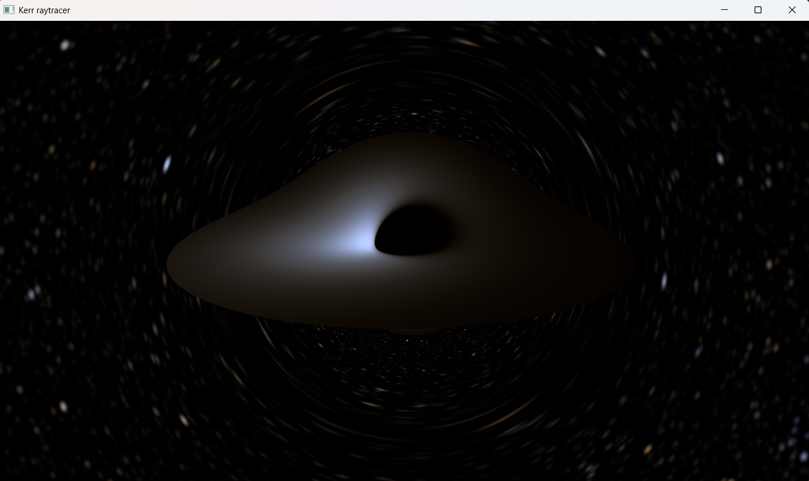

# Kerr-Black-Hole-Simulation
Python and GLSL simulation of Kerr Black holes. 

Null geodesic integration via RK4 over an affine parameter. The integrator uses
Kerr–Schild coordinates with a Boyer–Lindquist fallback, with geodesics
initialized at the ZAMO position. Disc colouring uses a lookup table built from
Planck's law, with the redshift factor applied. The goal was to keep the render
as physical as possible; all varied parameters are in natural units.

## References

### General relativity & Kerr geometry

- R. P. Kerr, "Gravitational Field of a Spinning Mass as an Example of Algebraically Special Metrics," *Phys. Rev. Lett.* **11**, 237–238 (1963). [doi:10.1103/PhysRevLett.11.237](https://doi.org/10.1103/PhysRevLett.11.237)
- R. P. Kerr & A. Schild, "Some Algebraically Degenerate Solutions of Einstein's Gravitational Field Equations," *Proc. Symp. Appl. Math.* **17**, 199 (1965). — Kerr–Schild form; basis for the Cartesian KS chart used here.
- J. M. Bardeen, W. H. Press & S. A. Teukolsky, "Rotating Black Holes: Locally Nonrotating Frames, Energy Extraction, and Scalar Synchrotron Radiation," *ApJ* **178**, 347–370 (1972). [doi:10.1086/151796](https://doi.org/10.1086/151796) — ZAMO frames; circular-geodesic `E(r)`, `L(r)`, `Ω(r)`; ISCO.
- J. M. Bardeen, "Timelike and Null Geodesics in the Kerr Metric," in *Black Holes (Les Astres Occlus)*, eds. C. DeWitt & B. S. DeWitt (Gordon & Breach, 1973), pp. 215–239. — analytic shadow silhouette used as the geometry validation gate.
- C. W. Misner, K. S. Thorne & J. A. Wheeler, *Gravitation* (W. H. Freeman, 1973).

### Accretion disc model

- I. D. Novikov & K. S. Thorne, "Astrophysics of Black Holes," in *Black Holes (Les Astres Occlus)*, eds. C. DeWitt & B. S. DeWitt (Gordon & Breach, 1973), pp. 343–450.
- D. N. Page & K. S. Thorne, "Disk-Accretion onto a Black Hole. I. Time-Averaged Structure of Accretion Disk," *ApJ* **191**, 499–506 (1974). [doi:10.1086/152990](https://doi.org/10.1086/152990) — relativistic thin-disc flux `F(r)`; zero-torque ISCO boundary condition.

### Colour science

- F. J. Ballesteros, "New insights into black bodies," *EPL* **97**, 34008 (2012). [doi:10.1209/0295-5075/97/34008](https://doi.org/10.1209/0295-5075/97/34008), [arXiv:1201.1809](https://arxiv.org/abs/1201.1809) — B−V → T_eff for stellar colour.
- C. Wyman, P.-P. Sloan & P. Shirley, "Simple Analytic Approximations to the CIE XYZ Color Matching Functions," *JCGT* **2**(2), 1–11 (2013). [jcgt.org/published/0002/02/01](http://jcgt.org/published/0002/02/01/) — multi-lobe Gaussian fits to the CIE 1931 CMFs.
- CIE, *Colorimetry*, 3rd ed., CIE 15:2004. — 1931 2° standard colorimetric observer.
- IEC 61966-2-1:1999, *Multimedia systems and equipment — Colour measurement and management — Part 2-1: Default RGB colour space — sRGB*. — D65 XYZ→sRGB matrix and transfer function.

### Data

- **HYG Database v4.1** — D. Nash / astronexus. <https://github.com/astronexus/HYG-Database> — 119,625 stars; equatorial Cartesian positions, V magnitude, B−V.
